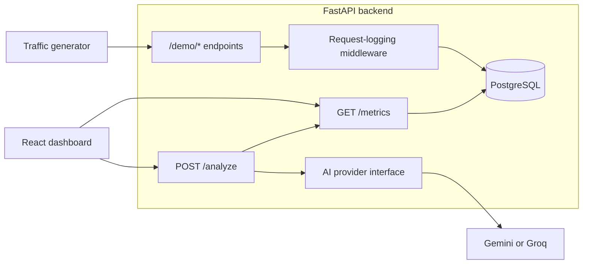

# AI-Enhanced API Performance Dashboard

A full-stack observability project: simulated API traffic is recorded in PostgreSQL, aggregated into latency, throughput and error metrics, shown in a React dashboard, and summarised in plain English by an LLM.

> **Status: work in progress.** The backend foundation is done; recording, metrics, dashboard and AI insights are planned. See [Status](#status).

## What it demonstrates

- **Backend engineering:** async FastAPI, SQLAlchemy 2 with Psycopg 3, Pydantic-validated configuration, request-level instrumentation.
- **Observability:** measuring latency and errors per endpoint, and turning raw request logs into windows, buckets and trends with SQL.
- **Frontend engineering:** typed React with TanStack Query and Recharts, including loading, empty and error states.
- **Responsible AI use:** the LLM only ever sees server-computed aggregates, sits behind a swappable interface, and is optional.
- **Engineering hygiene:** locked dependencies, static typing, linting, dependency audit, secret scanning and CI.

## How it works



1. Five mock endpoints (users, orders, products, search, reports) respond with configurable delays and failure rates.
2. Middleware records endpoint, method, status code, latency and timestamp for every call.
3. `/metrics` aggregates a time window into KPIs, per-endpoint stats, status codes, latency trends and recent requests.
4. `/analyze` sends that aggregate summary to an LLM and returns concise observations and next steps to investigate.

## Design decisions

| Decision | Reason |
| --- | --- |
| Only `/demo/*` traffic is measured | Dashboard polling, health checks and AI calls must not inflate the workload being observed |
| Aggregation happens in SQL, with one fixed window end per response | Correct, consistent snapshots; no averaging of averages |
| UTC timestamps, latency from a monotonic clock | Results do not depend on time zones or clock adjustments |
| AI receives aggregates only; clients cannot send prompts | Bounds cost and abuse, and keeps raw data private |
| AI sits behind a provider interface | Gemini and Groq are interchangeable without touching the rest of the backend |
| Metrics work without AI configured | AI is an enhancement, never a dependency |
| Alembic migrations, no schema changes at startup | Reproducible, reviewable database changes |

## AI-assisted insights

No model is trained or hosted. The backend sends a structured summary of recent metrics to a free-tier LLM API and asks practical questions: which endpoints are slower than expected, whether errors are concentrated in one service, what a bottleneck might look like, and what small step to try first. The prompt separates observations from hypotheses and does not claim a root cause from latency alone. The dashboard labels the output as AI-assisted analysis, not autonomous monitoring.

## Status

| Area | State |
| --- | --- |
| Service foundation: config, async database connection, `/health`, tooling, CI | Done |
| Request model and migration | Done |
| Demo routes and request logging | Planned |
| `/metrics` API | Planned |
| Traffic generator for demos | Planned |
| React dashboard | Planned |
| AI insights (`/analyze`) | Planned |
| Deployment on free-tier services | Planned |

Not in scope for the first release: authentication, alerting, monitoring real production APIs, model training, WebSockets and distributed storage.

## Tech stack

| Layer | Technology |
| --- | --- |
| Backend | Python 3.12–3.14, FastAPI, SQLAlchemy (async), Psycopg 3, Pydantic |
| Database | PostgreSQL 18, Alembic migrations |
| Frontend | React, Vite, TypeScript, TanStack Query, Axios, Recharts |
| AI | Google Gemini or Groq, called from the backend only |
| Tooling | uv, Ruff, Pyright, pytest, pip-audit, pre-commit, gitleaks, GitHub Actions |

## Repository layout

```text
backend/     FastAPI service, tests and tooling      -> backend/README.md
frontend/    React dashboard (not started)           -> frontend/README.md
```

## Quick start

Requires [uv](https://docs.astral.sh/uv/) and Docker. Full instructions, including the PostgreSQL container, are in the [backend guide](./backend/README.md#quick-start).

```bash
cd backend
make setup      # install dependencies, create .env
make run        # http://127.0.0.1:8000/docs
make check      # lint, format, types, tests
```

## Documentation

- [Backend](./backend/README.md): setup, configuration, data model, API contracts, testing, milestones
- [Frontend](./frontend/README.md): planned architecture and data flow
- [Continuous integration](./backend/CI.md): checks, local verification, branch protection
