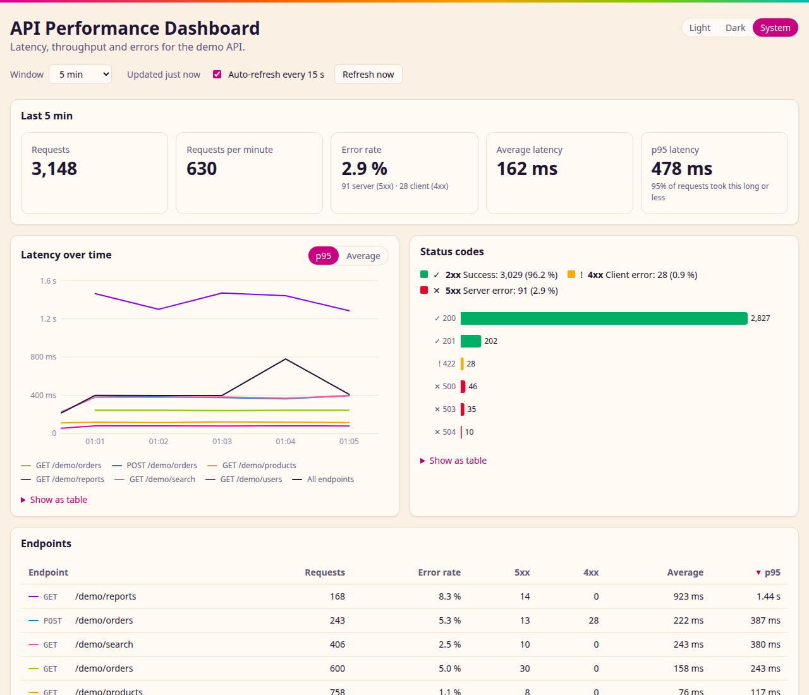
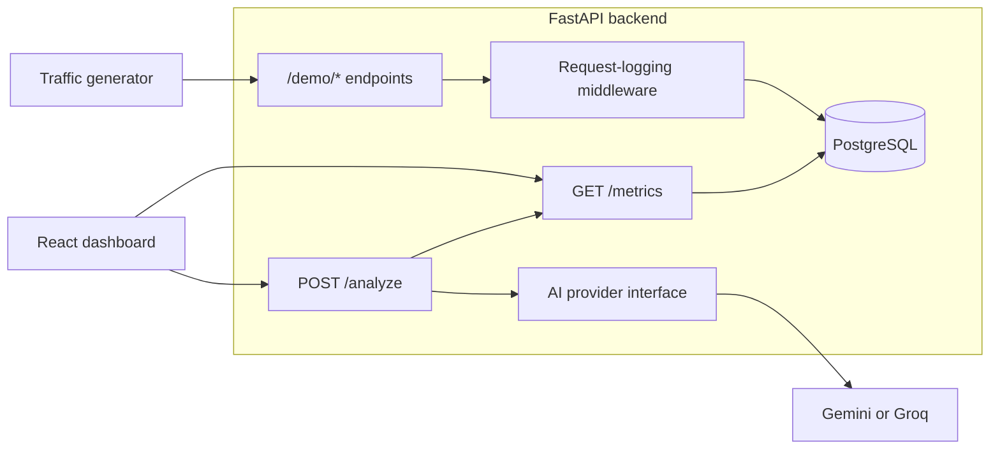

# AI-Enhanced API Performance Dashboard

A full-stack observability project: simulated API traffic is recorded in PostgreSQL, aggregated into latency, throughput and error metrics, and shown on a React dashboard. Plain-English summaries from an LLM are planned.

> **Status: backend and dashboard complete; AI insights planned.** The backend records every demo request, serves aggregated metrics at `GET /metrics` and includes a traffic generator (release `v0.2.0-backend`). The React dashboard shows KPI cards, latency and status-code charts and sortable tables from that one endpoint, refreshing itself, in light and dark themes. See [Status](#status).



<sub>Measured from live demo traffic (`make traffic`). A [dark theme](docs/images/dashboard-dark.png) follows the operating system or a toggle.</sub>

## Built so far

- **Backend engineering:** async FastAPI, SQLAlchemy 2 with Psycopg 3, Pydantic-validated configuration, Alembic migrations.
- **Request-level instrumentation:** simulated `/demo/*` endpoints with configurable latency and failure rates, and middleware that records endpoint, method, status code and latency for every call.
- **Metrics API:** `GET /metrics` returns summary, per-endpoint and status-code aggregates with p95 latency, latency trends in UTC-aligned buckets and recent requests, all read from one consistent snapshot and tested against a real PostgreSQL database. Measured at 17 ms for a one-hour window over 100,000 rows.
- **Traffic generator:** one command sends realistic, bounded live traffic (including deliberate client errors); a separate backfill mode writes clearly labelled synthetic history.
- **React dashboard:** strict TypeScript with types generated from the backend's OpenAPI schema (CI fails if they drift), TanStack Query polling that pauses in hidden tabs, Recharts charts with fixed per-endpoint colours validated for colour-vision deficiencies, and loading, empty, error and stale-data states. Checked with axe-core (no WCAG 2.1 AA violations in either theme), by keyboard alone, and at phone, tablet and desktop widths.
- **Engineering hygiene:** locked dependencies, static typing, linting, dependency audit, secret scanning, and CI that runs all of these plus unit and integration tests.

## Planned

- **AI insights:** an LLM that only ever sees server-computed aggregates, sits behind a swappable interface, and stays optional.

## How it works

The diagram shows the full design; [Status](#status) lists which parts are built.


```mermaid
flowchart LR
    T["Traffic generator"] --> D["/demo/* endpoints"]
    subgraph API ["FastAPI backend"]
        D --> M["Request-logging middleware"]
        M --> DB[("PostgreSQL")]
        Q["GET /metrics"] --> DB
        A["POST /analyze"] --> Q
        A --> P["AI provider interface"]
    end
    P --> L["Gemini or Groq"]
    UI["React dashboard"] --> Q
    UI --> A
```

1. Five mock endpoints (users, orders, products, search, reports) respond with configurable delays and failure rates.
2. Middleware records endpoint, method, status code, latency and timestamp for every call.
3. `/metrics` aggregates a time window into KPIs, per-endpoint stats, status codes, latency trends and recent requests.
4. *(Planned)* `/analyze` will send that aggregate summary to an LLM and return concise observations and next steps to investigate.

## Design decisions

| Decision | Reason |
| --- | --- |
| Only `/demo/*` traffic is measured | Dashboard polling, health checks and AI calls must not inflate the workload being observed |
| Aggregation happens in SQL, with one fixed window end per response | Correct, consistent snapshots; no averaging of averages |
| UTC timestamps, latency from a monotonic clock | Results do not depend on time zones or clock adjustments |
| AI receives aggregates only; clients cannot send prompts | Bounds cost and abuse, and keeps raw data private |
| AI sits behind a provider interface | Gemini and Groq are interchangeable without touching the rest of the backend |
| Metrics work without AI configured | AI is an enhancement, never a dependency |
| Alembic migrations, no schema changes at startup | Reproducible, reviewable database changes |

## AI-assisted insights (planned)

Not built yet; this is the design. No model will be trained or hosted. The backend will send a structured summary of recent metrics to a free-tier LLM API and ask practical questions: which endpoints are slower than expected, whether errors are concentrated in one service, what a bottleneck might look like, and what small step to try first. The prompt will separate observations from hypotheses and will not claim a root cause from latency alone. The dashboard will label the output as AI-assisted analysis, not autonomous monitoring.

## Status

| Area | State |
| --- | --- |
| Service foundation: config, async database connection, `/health`, tooling, CI | Done |
| Request model and migration | Done |
| Simulation engine (latency and failure profiles) | Done |
| Demo routes (`GET /demo/*`) | Done |
| `POST /demo/orders` (validated create) | Done |
| Request logging middleware, wired into the app | Done |
| `/metrics` response schemas and SQL queries (summary, per endpoint, status codes, latency trends, recent requests) | Done |
| `/metrics` endpoint (bounded parameters, read-only snapshot, performance-checked) | Done |
| Traffic generator for demos (live and synthetic backfill) | Done |
| React dashboard foundation: Vite and TypeScript scaffold, lint, format and test tooling, Holi theme tokens, CI | Done |
| React dashboard: typed API layer, controls, KPI cards, latency and status-code charts, sortable tables, light and dark themes | Done |
| AI insights (`/analyze`) | Next |
| Deployment on free-tier services | Planned |

Not in scope for the first release: authentication, alerting, monitoring real production APIs, model training, WebSockets and distributed storage.

## Tech stack

| Layer | Technology |
| --- | --- |
| Backend | Python 3.12–3.14, FastAPI, SQLAlchemy (async), Psycopg 3, Pydantic |
| Database | PostgreSQL 18, Alembic migrations |
| Frontend | React 19, Vite, TypeScript, CSS Modules, TanStack Query, Axios, Recharts, openapi-typescript |
| AI (planned) | Google Gemini or Groq, called from the backend only |
| Tooling | uv, Ruff, Pyright, pytest, pip-audit, ESLint, Stylelint, Prettier, Vitest, npm audit, pre-commit, gitleaks, GitHub Actions |

## Repository layout

```text
backend/     FastAPI service, tests and tooling      -> backend/README.md
frontend/    React dashboard                         -> frontend/README.md
docs/        README images
```

## Quick start

Requires [uv](https://docs.astral.sh/uv/) and Docker. Full instructions, including the PostgreSQL container, are in the [backend guide](./backend/README.md#quick-start).

```bash
cd backend
make setup      # install dependencies, create .env (then set DB_PASSWORD)
make migrate    # create the database tables
make run        # http://127.0.0.1:8000/docs
make traffic    # in a second terminal: 60 s of demo traffic
make check      # lint, format, types, tests
```

Then start the dashboard (requires Node.js 20.19 or later):

```bash
cd frontend
cp .env.example .env   # points the dashboard at http://127.0.0.1:8000
npm install
npm run dev            # http://localhost:5173
```

The raw data is at `http://127.0.0.1:8000/metrics?window_minutes=5&bucket_minutes=1`.

## Documentation

- [Backend](./backend/README.md): setup, configuration, data model, API contracts, testing, milestones
- [Frontend](./frontend/README.md): planned architecture, folder structure, modules and build order
- [Continuous integration](./backend/CI.md): checks, local verification, branch protection

## License

[MIT](./LICENSE)
