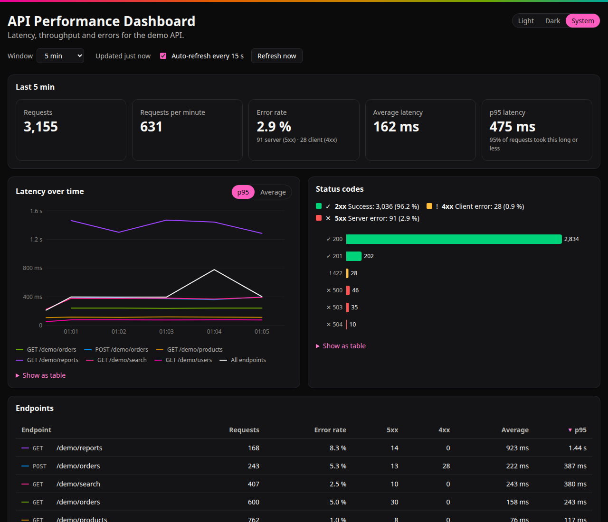
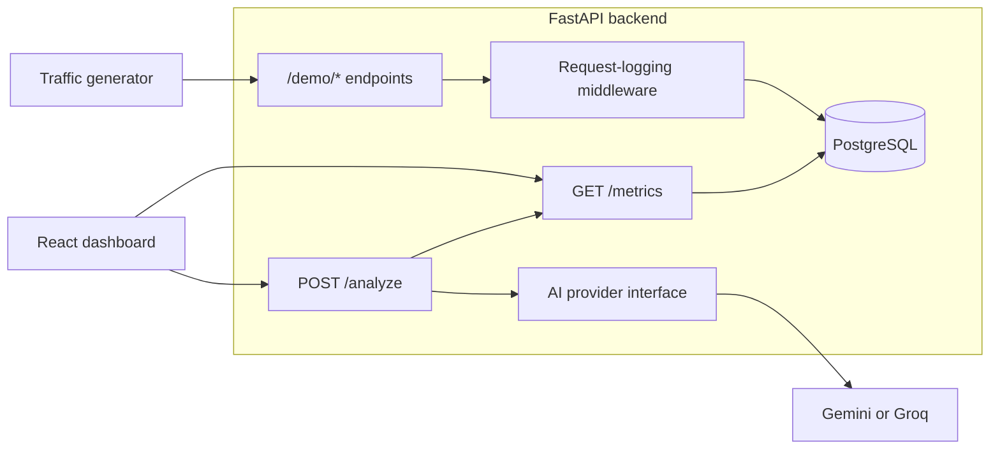
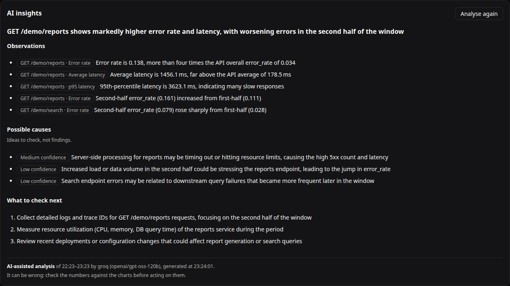

# AI-Enhanced API Performance Dashboard

A full-stack observability project: simulated API traffic is recorded in PostgreSQL, aggregated into latency, throughput and error metrics, and shown on a React dashboard. On request, an LLM explains what stands out in the selected window, in plain English.

> **Status: backend, dashboard and AI insights complete; deployment next.** The backend records every demo request, serves aggregated metrics at `GET /metrics` and includes a traffic generator. The React dashboard shows KPI cards, latency and status-code charts and sortable tables from that one endpoint, refreshing itself, in a dark theme by default with a light one a click away. Under the KPI cards, an AI insights panel asks `POST /analyze` to summarise the window: observations, possible causes and what to check next. See [Status](#status).



<sub>Measured from live demo traffic (`make traffic`). The header's toggle switches to the [light theme](docs/images/dashboard-light.png) or follows the operating system, and the choice is remembered.</sub>

## Built so far

- **Backend engineering:** async FastAPI, SQLAlchemy 2 with Psycopg 3, Pydantic-validated configuration, Alembic migrations.
- **Request-level instrumentation:** simulated `/demo/*` endpoints with configurable latency and failure rates, and middleware that records endpoint, method, status code and latency for every call.
- **Metrics API:** `GET /metrics` returns summary, per-endpoint and status-code aggregates with p95 latency, latency trends in UTC-aligned buckets and recent requests, all read from one consistent snapshot and tested against a real PostgreSQL database. Measured at 17 ms for a one-hour window over 100,000 rows.
- **Traffic generator:** one command sends realistic, bounded live traffic (including deliberate client errors); a separate backfill mode writes clearly labelled synthetic history.
- **AI insights:** `POST /analyze` sends only server-computed aggregates to Groq or Gemini, through one provider interface with plain REST calls, and validates the structured answer. It is protected by a 60-second cache, one in-flight call per window and an hourly quota, and rejects any answer that names an endpoint not in the data. A degraded demo mode makes one endpoint slow and flaky so there is a real problem to find.
- **React dashboard:** strict TypeScript with types generated from the backend's OpenAPI schema (CI fails if they drift), TanStack Query polling that pauses in hidden tabs, Recharts charts with fixed per-endpoint colours validated for colour-vision deficiencies, and loading, empty, error and stale-data states. Checked with axe-core (no WCAG 2.1 AA violations in either theme), by keyboard alone, and at phone, tablet and desktop widths.
- **Engineering hygiene:** locked dependencies, static typing, linting, dependency audit, secret scanning, and CI that runs all of these plus 699 tests: 395 backend unit tests, 68 integration tests against real PostgreSQL and 236 frontend tests.

## Planned

- **Deployment** on free-tier services.

## How it works


```mermaid
flowchart LR
    T["Traffic generator"] --> D["/demo/* endpoints"]
    subgraph API ["FastAPI backend"]
        D --> M["Request-logging middleware"]
        M --> DB[("PostgreSQL")]
        Q["GET /metrics"] --> DB
        A["POST /analyze"] --> Q
        A --> P["AI provider interface"]
    end
    P --> L["Gemini or Groq"]
    UI["React dashboard"] --> Q
    UI --> A
```

1. Five mock endpoints (users, orders, products, search, reports) respond with configurable delays and failure rates.
2. Middleware records endpoint, method, status code, latency and timestamp for every call.
3. `/metrics` aggregates a time window into KPIs, per-endpoint stats, status codes, latency trends and recent requests.
4. On request, `/analyze` sends that window's aggregates, with each endpoint's first and second half side by side, to an LLM and returns observations, possible causes and next steps to check.

## Design decisions

| Decision | Reason |
| --- | --- |
| Only `/demo/*` traffic is measured | Dashboard polling, health checks and AI calls must not inflate the workload being observed |
| Aggregation happens in SQL, with one fixed window end per response | Correct, consistent snapshots; no averaging of averages |
| UTC timestamps, latency from a monotonic clock | Results do not depend on time zones or clock adjustments |
| AI receives aggregates only; clients cannot send prompts | Bounds cost and abuse, and keeps raw data private |
| AI sits behind a provider interface | Gemini and Groq are interchangeable without touching the rest of the backend |
| Metrics work without AI configured | AI is an enhancement, never a dependency |
| Analysis runs only when asked, behind a cache, one call per window and an hourly quota | Free-tier quota is the scarce resource; polling must never spend it |
| An answer naming an endpoint not in the data is rejected whole | One invented endpoint means the answer cannot be trusted |
| Alembic migrations, no schema changes at startup | Reproducible, reviewable database changes |

## AI-assisted insights

No model is trained or hosted. When someone presses **Analyse**, the backend reads one snapshot of the window, ends the database transaction, and sends a compact JSON summary (about 600 tokens) to a free-tier LLM API: totals, per-endpoint stats, status codes, and each endpoint's p95 and error rate in the first and second half of the window. Clients cannot send prompts, and raw rows never leave the database.

The prompt keeps the model honest: use only the given numbers, judge only by comparison inside the data, treat causes as hypotheses at low or medium confidence, suggest things to check rather than changes to make, and say so when nothing stands out. The answer must match a strict schema, and one that names an unknown endpoint is rejected. With fewer than 20 requests in the window, the backend answers `no_data` without calling the model. The dashboard labels the result as AI-assisted analysis and reminds the reader to check it against the charts.



<sub>A real answer from Groq (`openai/gpt-oss-120b`) for one hour of synthetic backfill with `reports` degraded for the last 15 minutes (`make backfill HOURS=1 ARGS="--degrade reports --degrade-minutes 15"`). Every number in it matches `GET /metrics` for the same window.</sub>

## Status

| Area | State |
| --- | --- |
| Service foundation: config, async database connection, `/health`, tooling, CI | Done |
| Request model and migration | Done |
| Simulation engine (latency and failure profiles) | Done |
| Demo routes (`GET /demo/*`) | Done |
| `POST /demo/orders` (validated create) | Done |
| Request logging middleware, wired into the app | Done |
| `/metrics` response schemas and SQL queries (summary, per endpoint, status codes, latency trends, recent requests) | Done |
| `/metrics` endpoint (bounded parameters, read-only snapshot, performance-checked) | Done |
| Traffic generator for demos (live and synthetic backfill) | Done |
| React dashboard foundation: Vite and TypeScript scaffold, lint, format and test tooling, Holi theme tokens, CI | Done |
| React dashboard: typed API layer, controls, KPI cards, latency and status-code charts, sortable tables, light and dark themes | Done |
| Degraded demo mode (one endpoint slow and flaky on purpose) | Done |
| AI insights: `POST /analyze` (Groq and Gemini, cache, single-flight, quota) and the dashboard panel | Done |
| Deployment on free-tier services | Next |

Not in scope for the first release: authentication, alerting, monitoring real production APIs, model training, WebSockets and distributed storage.

## Tech stack

| Layer | Technology |
| --- | --- |
| Backend | Python 3.12–3.14, FastAPI, SQLAlchemy (async), Psycopg 3, Pydantic |
| Database | PostgreSQL 18, Alembic migrations |
| Frontend | React 19, Vite, TypeScript, CSS Modules, TanStack Query, Axios, Recharts, openapi-typescript |
| AI | Groq (`openai/gpt-oss-120b`) or Google Gemini (`gemini-3.5-flash-lite`), plain REST from the backend only, no vendor SDKs |
| Tooling | uv, Ruff, Pyright, pytest, pip-audit, ESLint, Stylelint, Prettier, Vitest, npm audit, pre-commit, gitleaks, GitHub Actions |

## Repository layout

```text
backend/     FastAPI service, tests and tooling      -> backend/README.md
frontend/    React dashboard                         -> frontend/README.md
docs/        README images
```

## Quick start

Requires [uv](https://docs.astral.sh/uv/) and Docker. Full instructions, including the PostgreSQL container, are in the [backend guide](./backend/README.md#quick-start).

```bash
cd backend
make setup      # install dependencies, create .env (then set DB_PASSWORD)
make migrate    # create the database tables
make run        # http://127.0.0.1:8000/docs
make traffic    # in a second terminal: 60 s of demo traffic
make check      # lint, format, types, tests
```

Then start the dashboard (requires Node.js 20.19 or later):

```bash
cd frontend
make setup      # install dependencies, create .env pointing at http://127.0.0.1:8000
make run        # http://localhost:5173
make check      # API types, lint, format, types, tests
```

The raw data is at `http://127.0.0.1:8000/metrics?window_minutes=5&bucket_minutes=1`.

AI insights are off by default. To turn them on, set `AI_PROVIDER=groq` (or `gemini`) and `AI_API_KEY` in `backend/.env`, or `AI_PROVIDER=fake` for a fixed, labelled answer without a key; see the [backend configuration](./backend/README.md#configuration).

## Documentation

- [Backend](./backend/README.md): setup, configuration, data model, API contracts, testing, milestones
- [Frontend](./frontend/README.md): architecture, folder structure, modules and build order
- [Continuous integration](./backend/CI.md): checks, local verification, branch protection

## License

[MIT](./LICENSE)
