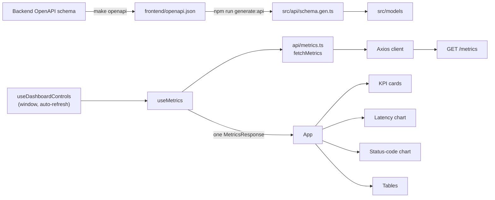

# Frontend

A React dashboard that presents the backend's API performance data and AI-assisted observations.

> **Status: API layer in place.** The app, tooling, Holi design tokens and CI from build step 1 are in place, and step 2 added the typed contract: `openapi.json`, generated types, `models/` and `api/`, tested against MSW. `useTheme` and `ThemeToggle` still finish step 1, then the panels follow the [build order](#build-order). The backend's `/metrics` contract is final (`backend/app/schemas/metrics.py`), so the folder structure and modules below are settled. `POST /analyze` does not exist yet, so everything for AI insights is marked *(later)*.

## What it will show

- **KPI cards:** total requests, average and p95 latency, error rate and requests per minute.
- **Latency chart:** overall and per-endpoint p95 and average latency over the selected window.
- **Status-code chart:** distribution of HTTP responses, grouped by class (2xx, 4xx, 5xx).
- **Endpoint table:** the same statistics for each method and route.
- **Recent requests:** a sortable table.
- **AI insights panel** *(later)*: on-demand analysis with loading, success, empty and error states, labelled as AI-assisted.
- **Controls:** time-window selector, automatic refresh toggle, manual refresh and "updated N seconds ago".

Every view handles loading, empty and error states, and the layout adapts from desktop to phone width.

## Stack

| Concern | Choice |
| --- | --- |
| Framework | React function components and hooks, Vite, TypeScript (strict) |
| Data fetching | TanStack Query (caching, loading and error states, refetch interval) with Axios |
| API types | `openapi-typescript`, generated from the backend's OpenAPI schema |
| Charts | Recharts |
| Styling | CSS Modules and CSS custom properties for theme tokens; no UI framework |
| Testing | Vitest, React Testing Library, Mock Service Worker (MSW) |
| Tooling | ESLint, Stylelint, Prettier, `tsc --noEmit`, `npm audit`, GitHub Actions |

## Data flow



1. `useMetrics` fetches `GET /metrics` once per refresh. **Every panel renders from that single response**, so the KPIs, charts and tables always describe the same snapshot, just as the backend computes them in one transaction. No component fetches on its own.
2. Types are generated from the backend's OpenAPI schema, so a contract change becomes a compile error instead of a runtime bug.
3. Raw values are formatted only at the edge (`lib/format.ts`): the API sends unrounded milliseconds, fractional rates, UTC timestamps and `null` for "nothing to measure", and the UI keeps them that way until display.
4. *(Later)* The insights panel calls `POST /analyze` only when the user asks, then shows the result or an actionable error.

## Folder structure

```text
frontend/
├── index.html
├── package.json, package-lock.json   Dependencies (locked; npm ci in CI)
├── vite.config.ts                    Dev server on port 5173 (matches the backend's default CORS origin), Vitest config
├── tsconfig.json                     strict, noUncheckedIndexedAccess
├── eslint.config.js, stylelint.config.js, .prettierrc.json
├── .env.example                      VITE_API_URL=http://127.0.0.1:8000
├── openapi.json                      Backend contract snapshot (generated, committed)
└── src/
    ├── main.tsx                      React root, QueryClientProvider, global styles
    ├── App.tsx                       Page layout; calls useMetrics once and passes slices down
    ├── config.ts                     Reads and validates VITE_API_URL once, at startup
    │
    ├── api/                          HTTP only: no React, no formatting
    │   ├── schema.gen.ts             Generated from openapi.json; never edited by hand
    │   ├── client.ts                 Axios instance: base URL, timeout, error normalisation
    │   ├── errors.ts                 ApiError and toApiError()
    │   ├── metrics.ts                fetchMetrics(params, signal)
    │   └── analysis.ts               (later) requestAnalysis(params)
    │
    ├── models/                       Types and constants, no runtime dependencies
    │   ├── metrics.ts                Named aliases of generated types (MetricsResponse, Summary, TrendBucket, ...)
    │   └── windows.ts                Time-window presets and their bucket sizes
    │
    ├── hooks/                        The only layer that talks to TanStack Query
    │   ├── queryClient.ts            Shared QueryClient and retry policy
    │   ├── useMetrics.ts             useQuery wrapper: key, polling, previous data while switching windows
    │   ├── useDashboardControls.ts   Selected window and auto-refresh, mirrored in the URL query string
    │   ├── useNow.ts                 Ticking clock for "updated N seconds ago"
    │   ├── useTheme.ts               Light, dark or system theme; sets data-theme on <html>
    │   ├── useChartColors.ts         Resolved token colours for Recharts, re-read on theme change
    │   └── useAnalysis.ts            (later) useMutation wrapper for POST /analyze
    │
    ├── lib/                          Pure functions, unit-tested, no React
    │   ├── format.ts                 Latency, percentages, counts, local times; null -> "—"
    │   ├── endpoints.ts              endpointKey() and endpointLabel(): "GET /demo/orders"
    │   ├── chartData.ts              Trend buckets -> Recharts rows; status codes -> classes
    │   └── sort.ts                   Stable, null-last comparators for the tables
    │
    ├── components/                   One folder per dashboard section; component, CSS Module and test side by side
    │   ├── layout/                   DashboardLayout, Header, ThemeToggle
    │   ├── controls/                 WindowSelector, RefreshControl
    │   ├── feedback/                 Panel, LoadingState, EmptyState, ErrorState, StaleDataBanner
    │   ├── kpis/                     KpiGrid, KpiCard
    │   ├── charts/                   LatencyChart, StatusCodeChart, ChartTooltip
    │   ├── tables/                   EndpointTable, RecentRequestsTable, SortableHeader
    │   └── insights/                 (later) InsightsPanel
    │
    ├── styles/
    │   ├── tokens.css                Design tokens as CSS variables; light and dark themes; reduced motion
    │   └── global.css                Small reset, base typography and focus outline
    │
    └── test/
        ├── setup.ts                  Testing Library matchers, MSW server lifecycle
        ├── server.ts                 MSW handlers for /metrics (success, empty, 422, 503, network error)
        └── fixtures/metrics.ts       Typed MetricsResponse fixtures: busy and empty; more are added with the panels that need them
```

## Module responsibilities

### Dependency rules

Imports flow in one direction, so each layer can be tested without the ones above it:

```text
components  ->  hooks  ->  api  ->  models
     \              \-> lib -/
      \-> lib, models
```

- `components/` never import from `api/` or TanStack Query; they receive data and callbacks as props. Only `App.tsx` and `InsightsPanel` call hooks that fetch.
- `api/` has no React imports and returns typed data or throws `ApiError`.
- `lib/` and `models/` are pure: no React, no Axios, no side effects.
- Only `api/schema.gen.ts` knows generated type names; the rest of the app imports from `models/`, so regeneration never ripples through components.

### `api/`

| Module | Responsibility |
| --- | --- |
| `client.ts` | One Axios instance with `baseURL` from `config.ts` and a 10-second timeout. A response interceptor turns every failure into an `ApiError`, except cancellation, which TanStack Query triggers on purpose and handles itself. |
| `errors.ts` | `ApiError` with a `kind` the UI can branch on: `network` (backend unreachable), `timeout`, `validation` (FastAPI `422`, keeps the first `msg`, such as the "too many buckets" hint), `server` (the shared `{ error: { code, message } }` body, such as `service_unavailable`) and `unknown`. Messages are safe to show; raw responses are never rendered. |
| `metrics.ts` | `fetchMetrics({ windowMinutes, bucketMinutes, recentLimit }, signal)` maps camelCase parameters to the query string and returns `MetricsResponse`. The `signal` lets TanStack Query cancel a request when the window changes. |
| `analysis.ts` | *(later)* `requestAnalysis({ windowMinutes })`. Sends no prompt or measurements; the server computes them. |

### `models/`

`metrics.ts` re-exports readable names (`MetricsResponse`, `Summary`, `EndpointMetrics`, `StatusCodeCount`, `TrendBucket`, `EndpointTrend`, `RecentRequest`, `ErrorResponse`) from the generated schema. Nullable fields stay `number | null`.

`windows.ts` holds the presets the selector offers. Each respects the backend's limits (1–1440 minutes, at most 288 buckets) and targets 12–60 points per chart:

| Label | `window_minutes` | `bucket_minutes` | Buckets |
| --- | --- | --- | --- |
| 5 min | 5 | 1 | 5 |
| 15 min | 15 | 1 | 15 |
| 1 hour (default) | 60 | 5 | 12 |
| 6 hours | 360 | 15 | 24 |
| 24 hours | 1440 | 60 | 24 |

A unit test asserts every preset stays within those limits, so a new preset cannot trigger a `422`.

### `hooks/`

| Hook | Contract |
| --- | --- |
| `useMetrics(window, { autoRefresh })` | Query key `['metrics', windowMinutes, bucketMinutes, recentLimit]`. Polls every 15 seconds when auto-refresh is on; TanStack Query pauses polling while the tab is hidden and refetches on focus. Keeps the previous window's data on screen while a new window loads. Retries network errors and `5xx` twice; never retries `4xx`. |
| `useDashboardControls()` | Selected preset and auto-refresh flag, read from and written to the URL query string (`?window=60&refresh=on`), so a view can be bookmarked or shared without adding a router. Unknown values fall back to the defaults. |
| `useNow(intervalMs)` | Current time, ticking, for relative "updated" labels. Kept separate so only that label re-renders every second. |
| `useAnalysis()` | *(later)* `useMutation` around `requestAnalysis`; only runs when the user clicks. |

`queryClient.ts` centralises defaults (`staleTime` 10 seconds, the retry rule above) so tests build the same client with retries off.

### `lib/`

| Module | Responsibility |
| --- | --- |
| `format.ts` | `formatLatency` (`842 ms`, `1.24 s`), `formatPercent` (fraction to `3.2 %`), `formatCount`, `formatRate` (per minute), `formatTime` and `formatRelative` in the viewer's local time zone via `Intl`. Every function renders `null` as "—", never `0`. |
| `endpoints.ts` | `endpointKey(method, endpoint)` for React keys, series names and colours, since `GET` and `POST /demo/orders` are different series. |
| `chartData.ts` | `toLatencyRows(trend, metric)` pivots `overall` and `by_endpoint` buckets into one row per bucket start (epoch milliseconds), leaving `null` where a bucket was empty so Recharts draws a gap instead of a false zero. `toStatusClasses(codes)` groups codes by class for colouring. |
| `sort.ts` | Comparators for the tables; `null` sorts last in both directions. |

### `components/`

| Folder | Components | Notes |
| --- | --- | --- |
| `layout/` | `DashboardLayout`, `Header` | CSS grid: KPIs across the top, charts in two columns on desktop and one on phones, tables full width. |
| `controls/` | `WindowSelector`, `RefreshControl` | Native `<select>` and `<button>` for keyboard and screen-reader support. `RefreshControl` shows "updated N seconds ago", the auto-refresh toggle and "Refresh now". |
| `feedback/` | `Panel`, `LoadingState`, `EmptyState`, `ErrorState`, `StaleDataBanner` | `Panel` is the frame every section uses; it picks loading, empty, error or content, so each section handles all four states the same way. If a refresh fails after a success, the last data stays visible under `StaleDataBanner` instead of being replaced by an error. |
| `kpis/` | `KpiGrid`, `KpiCard` | Takes `Summary`. Error rate counts `5xx` only; the card shows `4xx` separately, matching the backend's definition. |
| `charts/` | `LatencyChart`, `StatusCodeChart`, `ChartTooltip` | `LatencyChart` has a p95/average toggle and one line per endpoint plus "All endpoints"; the X axis is time with the window's local-time bounds. `StatusCodeChart` is a bar chart coloured by class. Both have a text summary for screen readers. |
| `tables/` | `EndpointTable`, `RecentRequestsTable`, `SortableHeader` | Client-side sorting with `aria-sort`; tables scroll horizontally inside their panel on narrow screens, never the page. |
| `insights/` | *(later)* `InsightsPanel` | Labelled "AI-assisted analysis". Shows the provider and generation time, and a clear message when AI is not configured on the server. |

### Error and empty states

| Situation | What the user sees |
| --- | --- |
| First load | Skeletons in each panel, sized like the content, so the layout does not jump |
| Window has no requests | `EmptyState` with the command that generates traffic (`make traffic`); KPIs show "—" |
| Backend unreachable (`network`, `timeout`) | `ErrorState` naming the configured API URL, with "Try again" |
| `503 service_unavailable` | The server's message ("The service is temporarily unavailable.") with "Try again" |
| `422` | The first validation message; this means a preset is wrong, so it also logs to the console |
| Refresh fails after data was shown | Last data stays, with `StaleDataBanner` ("Showing data from 10:42; refresh failed") |

## Styling

CSS Modules for each component and one shared set of design tokens as CSS custom properties. Vite supports both without extra dependencies, class names are scoped to their component, styles sit next to the component they belong to, and nothing runs at runtime.

| Option | Why not |
| --- | --- |
| Tailwind | Another tool and long class lists in markup; charts still need colours in JavaScript |
| CSS-in-JS (styled-components, Emotion) | Runtime cost, and the ecosystem is moving away from it |
| Component library (MUI, Chakra) | Heavy, generic look, and fights custom chart styling |

### Files

| File | Contents |
| --- | --- |
| `styles/tokens.css` | Every colour, space, size, radius, shadow and duration, for both themes. Under `prefers-reduced-motion` it sets `--duration-fast` to `0ms`, and every transition uses that token, so no `!important` override is needed |
| `styles/global.css` | Small reset, base typography, `:focus-visible` outline; the only place global selectors are allowed |
| `components/**/X.module.css` | One module per component, imported as `styles` and used as `styles.cardValue` |

### Design tokens

Tokens are named by purpose, not by value (`--color-text-muted`, never `--gray-500`), so a theme only redefines variables and components never change.

| Group | Tokens |
| --- | --- |
| Colour | `--color-bg`, `--color-surface`, `--color-surface-raised`, `--color-border`, `--color-text`, `--color-text-muted`, `--color-axis`, `--color-grid`, `--color-accent`, `--color-accent-text`, `--color-on-accent` |
| Status | `--color-success`, `--color-warning`, `--color-danger`, each with a `-text` variant for words and a `-subtle` background variant |
| Chart series | `--color-series-1` … `--color-series-8`, distinguishable in both themes and for common colour-vision deficiencies |
| Space | `--space-1` … `--space-8` on a 4 px base, in `rem` |
| Type | Five sizes (`--text-xs` … `--text-xl`), system font stack, no web font |
| Other | `--radius-sm`, `--radius-md`, `--shadow-panel`, `--duration-fast` |

Numbers in KPIs and tables use `font-variant-numeric: tabular-nums` so digits line up and do not shift on refresh.

### Palette: Holi

The theme is named after the festival of colours: eight saturated hues on a warm cream day theme and a near-black night theme. Every value below is final and goes into `tokens.css` as written.

**Neutrals and accent**

| Token | Light | Dark |
| --- | --- | --- |
| `--color-bg` (page) | `#fbf0e4` | `#0b0b0c` |
| `--color-surface` (panels, cards) | `#fffaf3` | `#141416` |
| `--color-surface-raised` (tooltips, menus) | `#ffffff` | `#1c1c1f` |
| `--color-border` | `#e7dccd` | `#2a2a2e` |
| `--color-text` | `#1f1633` | `#f5f5f4` |
| `--color-text-muted` | `#62577a` | `#b4b2ad` |
| `--color-axis` (ticks, axis labels) | `#8a7f9e` | `#85837e` |
| `--color-grid` (chart gridlines) | `#efe4d6` | `#1f1f22` |
| `--color-accent` (buttons, focus ring) | `#c8007f` | `#ff5cc0` |
| `--color-accent-text` (links, selected text) | `#b3006f` | `#ff7ccd` |
| `--color-on-accent` (text on accent) | `#ffffff` | `#141416` |

A thin decorative strip across the top of the header runs through series 1, 8, 4, 2 and 7 (fuchsia, tangerine, marigold, lime, turquoise). It carries no meaning, so it is exempt from contrast rules.

**Chart series**, assigned in this fixed order:

| Slot | Colour | Light | Dark | Used for |
| --- | --- | --- | --- | --- |
| 1 | Fuchsia | `#e10095` | `#eb009b` | `GET /demo/users` |
| 2 | Lime | `#84c900` | `#6da600` | `GET /demo/orders` |
| 3 | Azure | `#007dd6` | `#008ff4` | `POST /demo/orders` |
| 4 | Marigold | `#efa200` | `#c78600` | `GET /demo/products` |
| 5 | Pink | `#ff5799` | `#ff288c` | `GET /demo/search` |
| 6 | Violet | `#8700ec` | `#9c44ff` | `GET /demo/reports` |
| 7 | Turquoise | `#00beaf` | `#00a99b` | Spare |
| 8 | Tangerine | `#f56600` | `#e25e00` | Spare |

The "All endpoints" line uses `--color-text`, so it reads as the reference and never competes with a series.

**Status**, fixed and never reused for series:

| Token | Light fill | Light text | Dark (fill and text) |
| --- | --- | --- | --- |
| `--color-success` | `#00ae64` | `#007742` | `#00d27a` |
| `--color-warning` | `#fcab00` | `#8d5e00` | `#ffbe3d` |
| `--color-danger` | `#ef0028` | `#bc001d` | `#ff5352` |

`-subtle` backgrounds are the fill at 14 % opacity (`color-mix(in srgb, var(--color-success) 14%, transparent)`). The status-code chart colours 2xx, 4xx and 5xx with these tokens; the latency chart uses series tokens only, so the two never meet in one chart.

**Rules for the palette**

- A series colour follows the endpoint, not its rank: `endpointKey()` maps each method and route to a fixed slot, so filtering or sorting never repaints the survivors.
- More than eight series fold into "Other" rather than generating a new colour.
- Series colours never colour text; labels and values use the text tokens, with a coloured mark beside them.
- Status always comes with a label or icon, never colour alone.

**Validation**, run with an OKLCH lightness, chroma, colour-vision (Machado 2009 protanopia and deuteranopia) and contrast checker:

| Check | Light | Dark | Requirement |
| --- | --- | --- | --- |
| Worst neighbouring pair, colour-blind vision | ΔE 15.9 | ΔE 11.7 | at least 8 |
| Worst neighbouring pair, normal vision | ΔE 24.0 | ΔE 25.3 | at least 15 |
| First three slots, any pair | pass | pass | for charts where any two marks can touch |
| Series vs surface contrast | 5 of 8 below 3:1 | all 8 at least 3:1 | 3:1, or a legend and table view |
| Text, muted text, accent text, status text vs surface | at least 4.5:1 | at least 4.5:1 | 4.5:1 |

Lime, marigold, turquoise, pink and tangerine sit below 3:1 on the cream surface, which is expected for vivid yellows and greens on a light background. Every chart therefore keeps its legend, tooltip and table view; no value is ever shown by a light-mode series colour alone.

### Themes

- The default follows the operating system through `prefers-color-scheme`.
- `ThemeToggle` offers light, dark and system. `useTheme` sets `data-theme` on `<html>` and remembers the choice in `localStorage`, with reads and writes wrapped so the page still works when storage is blocked.
- `tokens.css` defines the light values on `:root`, the dark values under `prefers-color-scheme: dark` (unless `data-theme="light"`), and again under `[data-theme="dark"]`.
- Recharts sets colours through SVG attributes, where CSS variables are not reliably resolved. `useChartColors` reads the resolved token values with `getComputedStyle` and reads them again when the theme changes, so charts use the same palette as the rest of the page.

### Layout

- Mobile first, with `min-width` media queries at two breakpoints: 640 px and 1024 px.
- The page is a CSS grid: one column on phones; from 1024 px, KPIs in four columns, charts in two, tables full width.
- Panels are size containers, and their contents use container queries (`@container`), so a KPI card or chart adapts to the panel's width, not the screen's.
- Tables scroll horizontally inside their panel; the page itself never scrolls sideways.
- Logical properties (`padding-inline`, `margin-block`) throughout.

### Accessibility

- Text meets WCAG AA (4.5:1) in both themes. Chart marks meet 3:1 in dark mode; in light mode the lighter series rely on the legend, tooltip and table view (see the palette validation above).
- Status is never shown by colour alone: a `5xx` also carries a label or icon.
- Every control has a visible `:focus-visible` outline.
- `prefers-reduced-motion` disables transitions and chart animations.

### Rules

- camelCase class names; one module per component.
- No global classes outside `global.css`, no `!important`, no raw colours or pixel spacing outside `tokens.css` (Stylelint enforces the last two).
- Shared patterns are reused with `composes:` rather than copied.
- Stylelint (`stylelint-config-standard` plus a CSS Modules config) runs locally and in CI; Prettier formats CSS.

## Contract and type generation

The backend already builds its OpenAPI schema without a database, so the contract can be exported offline:

1. **Backend:** `make openapi` (in `backend/`) writes `app.openapi()` to `frontend/openapi.json`.
2. **Frontend:** `npm run generate:api` runs `openapi-typescript openapi.json -o src/api/schema.gen.ts`.
3. **CI:** Backend CI runs `make openapi-check` and Frontend CI runs `npm run check:api`. Each regenerates in memory and fails if the committed file differs, so a backend change that alters the contract cannot merge without the frontend seeing it.

Both generated files are committed, so the frontend builds without a running backend. Prettier skips them, so they stay byte-for-byte what the generators write.

### Updating the API contract

After changing a backend route or schema:

```bash
cd backend && make openapi              # refresh frontend/openapi.json
cd ../frontend && npm run generate:api  # refresh src/api/schema.gen.ts
npm run check                           # type errors show every place the change affects
```

Commit both files with the backend change.

### TypeScript 6 and `openapi-typescript`

`openapi-typescript` 7 declares TypeScript 5 as a peer dependency, and no release supports 6 yet. An `overrides` entry in `package.json` points it at the app's TypeScript instead. It is scoped to that one package, unlike `--legacy-peer-deps`, which would relax peer checks for everything, and it keeps the generator pinned in the lockfile, unlike running it through `npx`. The generator only prints TypeScript through the compiler API, and `check:api` in CI would catch any change in its output. Remove the override once a release supports TypeScript 6.

## Configuration

`VITE_API_URL` sets the backend base URL, so local and deployed environments differ only by configuration. `config.ts` validates it once at startup and fails with a clear message if it is missing or not a URL. It is public: never place secrets in `VITE_*` variables. AI keys live only in the backend.

The Vite dev server runs on port 5173, the backend's default `CORS_ORIGINS` entry, so local development needs no proxy. A router is deliberately left out; the URL query string holds the only state worth sharing, and a router can be added if the dashboard grows beyond one view.

## Development

Requires Node.js 20.19 or later (CI uses 24). From `frontend/`:

```bash
cp .env.example .env   # once; sets VITE_API_URL to the local backend
npm install
npm run dev            # http://localhost:5173, with the backend on http://127.0.0.1:8000
npm run check          # API types, ESLint, Stylelint, Prettier, types and tests, as CI runs them
npm run build          # production build in dist/
```

`npm run format` rewrites files with Prettier and `npm run test:watch` reruns tests on save. Stylelint rejects raw colours, pixel spacing, non-camelCase class names and `!important` outside `tokens.css`.

## Testing

| Layer | How |
| --- | --- |
| `lib/`, `models/` | Plain Vitest unit tests: formatting edge cases (`null`, `0`, sub-millisecond, over one second), pivoting trends with empty buckets, preset limits |
| `api/` | MSW returns each backend response (success, empty, `422`, `503`, network failure); assert the typed result or the `ApiError` kind |
| `hooks/` | `renderHook` with a test `QueryClient`: query keys, polling on and off, no retry on `4xx`, previous data kept while switching windows |
| `components/` | Testing Library with the typed fixtures: each panel's four states, sorting, keyboard use of the controls |
| `App` | One integration test per fixture: busy, empty and failing backend render the right states end to end |

Fixtures are typed as `MetricsResponse`, so a contract change breaks them at compile time too.

## Build order

Each step is one reviewable pull request that leaves the app working.

| Step | Scope | Done when |
| --- | --- | --- |
| 1. Scaffold | Vite, TypeScript, ESLint, Stylelint, Prettier, Vitest, `config.ts`, `styles/` with light and dark tokens, `useTheme` and `ThemeToggle`, a `frontend-ci.yml` workflow (install, lint, format, types, tests, build, audit) | CI is green on an empty page that switches theme |
| 2. Contract | `make openapi`, `openapi.json`, `schema.gen.ts`, `models/`, `api/` with tests, the freshness check in CI | `fetchMetrics` is typed end to end and tested against MSW |
| 3. Pure logic | `lib/` and `models/windows.ts` with unit tests | Formatting and chart pivots are covered, including `null` and empty buckets |
| 4. Data and controls | `hooks/`, `controls/`, `feedback/`, `layout/`, `App.tsx` | Switching windows and auto-refresh work against the real backend; every state renders |
| 5. KPIs and charts | `kpis/`, `charts/` | Charts match `/metrics` output for a generated traffic run |
| 6. Tables | `tables/` | Sorting, `aria-sort` and narrow-screen scrolling work |
| 7. Polish | Visual check of both themes at phone, tablet and desktop widths, contrast and accessibility pass, README screenshots | Usable at 360 px wide and by keyboard only, AA contrast in both themes |
| 8. AI insights *(later)* | `api/analysis.ts`, `useAnalysis`, `insights/` | Starts once `POST /analyze` exists in the backend |
